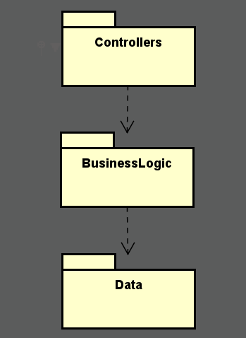
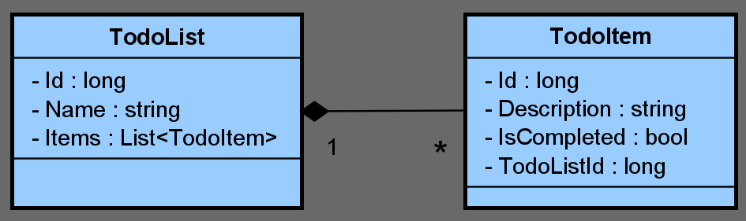

# TodoApi

Esta es una API sencilla de lista de tareas (TodoList) construida con .NET 8. 

## Base de datos

La base de datos se ejecuta dentro del mismo DevContainer usando Docker.

## Build

En mi caso se utilizó el devcontainer proporcionado para correr la aplicacion, dentro de la terminal generada correr los siguientes comandos:

```bash
# Compilar la API
dotnet build

# Crear/Actualizar base de datos
dotnet ef database update

# Correr la API
dotnet run

# o en caso de que la ruta en la terminal sea /app

dotnet run --project TodoApi
```

## Test

Se realizaron tests tanto para los nuevos servicios implementados (en la próxima sección será explicado), como para los controllers.

Para correr los tests:

```bash
dotnet test
```

## Cambios Realizados

En esta seccion se documentan los principales cambios realizados al proyecto base que me fue proporcionado.

### 1. Nuevos servicios creados

- `TodoListService`

- `TodoItemService`

Antes, los controllers se encargaban tanto de exponer la API como de gestionar lógica de negocio (por ejemplo, crear la entidad TodoList en base al mapeo del dto). Esto no estaba muy alineado con el principio SOLID de Single Responsibility, ya que una misma clase cumplía dos responsabilidades:

- Exponer los endpoints de la API.

- Aplicar la lógica de negocio (persistencia directa, mapeo de dtos a entidades reales).

Aunque entiendo que en el proyecto original esto se había implementado así por simplicidad, ya que no existían validaciones o lógica de negocio complejas debido a la naturaleza simple del problema. En este nuevo enfoque, se separó claramente cada responsabilidad. 

Las dependencias quedan dirigidas hacia abajo mismamente, de la siguiente manera:



### 2. Mock en tests

En los tests de los controllers, se utiliza Moq para crear un mock de la interfaz `ITodoListService`, de modo que el TodoListsController dependa únicamente de esa implementación simulada, sin invocar la capa de negocio real ni el acceso a datos. De esta forma se aísla el controller.

En cuanto a los tests de los servicios, se utiliza una base de datos en memoria tal cual se hacia eantes en los controllers.

### 3. Dtos

Se utilizaron Dtos como `TodoItemDto` o `TodoListDto`, para no exponer directamente la entidad al exterior y desacoplar la estructura de la base de datos del "contrato" de la API. De este modo, solo enviamos al consumidor la información necesaria, en este caso son todos los campos, pero podría no ser el caso con otro dominio.

### 4. Dependencias

Se agregó dependencia TodoApi -> Linq   
Se agregó dependencia TodoApi.Tests -> Moq

### 5. Cambios en `devcontainer.json`

Se realziaron algunas modificaciones en este archivo:

- "remoteUser": "root"  

Se estableció al usuario root como predeterminado dentro del contenedor ya que habían ciertos problemas de permisos al ejecutar comandos.

- "workspaceFolder": "/app/TodoApi"

Se ajustó la ruta que el contenedor considera como “carpeta de trabajo” de /app a /app/TodoApi para ejecutar comandos como `dotnet run` directamente.

- "postCreateCommand": "dotnet restore && dotnet build && dotnet dev-certs https && dotnet tool restore"

Se agregaron los comandos `dotnet dev-certs https && dotnet tool restore`. Principalmente para evitar ciertos errores de certificado https y para restaurar las herramientas globales necesarias para crear o actualizar la base de datos.

## Nuevas Funcionalidades



Se agregó una nueva entidad llamada TodoItem. En el diagrama de clases se puede observar una relación de composición entre TodoList y TodoItem. Esta indica que cada TodoList puede tener cero o un número x de TodoItems, y al eliminar la lista, todos los ítems asociados se borran automáticamente. De esta manera, se garantiza que no queden tareas "huérfanas" al eliminar una lista completa.

En base a esta nueva clase, se exponen los siguientes endpoints:

| Verbo  | URI                                                      | Parámetros                                | Responses          | 
|--------|----------------------------------------------------------|-------------------------------------------|--------------------|
| GET    | `/api/todolists/{todoListId}/items/{todoItemId}`         | Path: `todoListId`, `todoItemId`          | 200, 404 500       |
| POST   | `/api/todolists/{todoListId}/items`                      | Path: `todoListId`; Body: `Description`| 201, 404, 500      |
| PUT    | `/api/todolists/{todoListId}/items/{todoItemId}`         | Path: `todoListId`, `todoItemId`; Body: `Description` | 200, 404, 500 |
| PUT    | `/api/todolists/{todoListId}/items/{todoItemId}/complete`| Path: `todoListId`, `todoItemId`          | 204, 404, 500      |
| DELETE | `/api/todolists/{todoListId}/items/{todoItemId}`         | Path: `todoListId`, `todoItemId`          | 204, 404, 500      |


## Oportunidades de Mejora

En esta seccion se listan oportunidades de mejora identificadas, pero que por una cuestion de tiempo no fueron implementadas:

### Ocultar los Ids en las rutas
Utilizar identificadores alternativos (por ejemplo GUID) en lugar de exponer el Id directamente en los endpoints.

### Excepciones personalizadas
Definir clases de excepción específicas, para enviar mensajes más claros y “humanos” a quien mantenga el backend en el futuro.

### Tests más exhaustivos
Ampliar los casos de prueba cubriendo escenarios de error y otros flujos inesperados. Actualmente solo se valida el “camino feliz”.

## Experiencia de Implementación

Esta parte del desafío fue muy disfrutable, ya que había trabajado con APIs en .NET anteriormente. Sin embargo, fue necesario dedicar tiempo a familiarizarme con la herramienta DevContainer (nunca la había utilizado), que al final resultó sumamente útil porque me permitió ejecutar tanto la aplicación como la base de datos en Docker sin tener que configurar nada externamente. 

En líneas generales, estoy conforme con el resultado, con más tiempo se podrían haber implementado aún más mejoras.